# 통합 건강기능식품 제품 데이터 탐색적 데이터 분석(EDA) 보고서

- **분석 데이터셋**: `NutriFit-Dashboard/data/integrated_products.csv`
- **전체 데이터 수**: 28,466개 레코드
- **변수 개수**: 11개 컬럼 (`플랫폼, 브랜드, 제품명, 전성분, 제형, 알레르기 성분, 가격, 리뷰수, 평점, 상품URL, 이미지URL`)
- **보고서 작성일**: 2026년 7월 11일
- **분석 도구**: Python Pandas, Matplotlib, Scikit-learn (TF-IDF)

---

## 1. 데이터 기본 검사 및 품질 확인 (Initial Data Inspection)

본 분석은 iHerb, 올리브영, 쿠팡에서 수집 및 통합한 총 28,466개의 제품 정보를 대상으로 데이터 무결성과 비즈니스적 시사점을 파악하기 위해 진행되었습니다.

- **전체 행 수**: 28,466개
- **전체 열 수**: 11개
- **중복된 행 수**: 658개
- **결측값 현황**:
|               |   결측치 수 |
|:--------------|------------:|
| 플랫폼        |           0 |
| 브랜드        |           0 |
| 제품명        |           0 |
| 전성분        |       28466 |
| 제형          |           0 |
| 알레르기 성분 |       28466 |
| 가격          |           0 |
| 리뷰수        |           0 |
| 평점          |           0 |
| 상품URL       |           0 |
| 이미지URL     |       25171 |

> [!NOTE]
> `전성분` 및 `알레르기 성분` 컬럼은 크롤링 소스상의 누락으로 인해 100% 결측치로 비어 있습니다. `이미지URL` 컬럼은 iHerb 제품군(25,171건)에 대한 이미지 주소가 수집되지 않아 결측치로 반영되었으며, 올리브영 및 쿠팡 제품군은 정상 적재되었습니다.

### 1.2 성분 대분류 분석 매핑 기준

수집된 건강기능식품 데이터의 다차원 분석 및 향후 개인화 큐레이션 추천 서비스 연계를 위해, 아래와 같은 성분 대분류 매핑 기준을 설정하여 적용합니다. 본 분류 체계는 사용자의 건강 고민, 기저질환, 식습관과 매칭될 수 있도록 기능성 원료 및 성분을 기준으로 카테고리화되었습니다.

| 성분 대분류 | 세부 성분 카테고리 (매핑 키워드) | 매칭되는 유저 고민 / 기저질환 / 습관 |
| :--- | :--- | :--- |
| **기초 영양 / 에너지** | 비타민 B군, 비타민 C, 비타민 D, 멀티비타민 | 피로 개선, 운동 빈도 높음, 흡연자 |
| **장 건강 / 소화** | 유산균 (프로바이오틱스), 프리바이오틱스, 소화효소 | 장 건강, 위장 민감 |
| **간 건강 / 해독** | 실리마린 (밀크씨슬), 아티초크 추출물 | 잦은 음주 (주 2회 이상) |
| **혈행 / 항산화** | 오메가3 (EPA 및 DHA), 코엔자임Q10, 스쿠알렌 | 혈압 염려, 혈행·콜레스테롤 염려 |
| **스트레스 / 수면** | 테아닌, 홍경천 추출물, 마그네슘, 멜라토닌 | 스트레스 자가인지 높음, 수면 장애 |
| **눈 건강** | 루테인 (마리골드꽃추출물), 지아잔틴, 아스타잔틴 | 눈 건강, 40대 이상 고연령 |

### 1.3 성분 대분류별 통합 제품 데이터 분석 결과

수집된 전체 28,466개의 통합 제품 데이터를 대상으로 설정한 성분 대분류 매핑 키워드를 적용하여 실제 각 성분군별 공급 규모(매칭 제품 수)와 평균 가격, 평균 평점, 평균 리뷰수 분포를 추출한 결과는 다음과 같습니다.

| 성분 대분류        |   매칭 제품 수 (개) | 평균 가격 (원)   | 평균 평점 (점)   | 평균 리뷰 수 (개)   |
|:-------------------|--------------------:|:-----------------|:-----------------|:--------------------|
| 기초 영양 / 에너지 |               4,560 | 28,950원         | 4.66점           | 3,768개             |
| 장 건강 / 소화     |                 730 | 39,824원         | 4.64점           | 3,701개             |
| 간 건강 / 해독     |                 107 | 27,484원         | 4.22점           | 2,954개             |
| 혈행 / 항산화      |               1,018 | 45,486원         | 4.70점           | 6,496개             |
| 스트레스 / 수면    |               1,525 | 27,150원         | 4.61점           | 3,447개             |
| 눈 건강            |                 258 | 31,338원         | 4.63점           | 4,824개             |

> [!TIP]
> - **'기초 영양 / 에너지'** 카테고리는 비타민 함유 제품이 절대다수를 차지하여 매칭 제품 수가 가장 많고 대중적인 가격대를 형성하고 있습니다.
> - **'장 건강 / 소화'** 및 **'간 건강 / 해독'** 등 특정 기능성 원료들은 상대적으로 평균 가격대가 더 높게 집중되어 유통 마진 및 객단가가 높음을 시사합니다.

---

## 2. 기초 기술통계 분석 (Descriptive Statistics)

### 2.1 수치형 변수 기초통계
|       |     가격 |    리뷰수 |     평점 |
|:------|---------:|----------:|---------:|
| count |  28466   |  28466    | 28466    |
| mean  |  36480.7 |   2499.57 |     4.59 |
| std   |  28557.3 |  12165.3  |     0.77 |
| min   |      0   |      0    |     0    |
| 25%   |  19208   |     45    |     4.6  |
| 50%   |  28988   |    241    |     4.7  |
| 75%   |  44584.5 |   1072.75 |     4.8  |
| max   | 784000   | 486127    |     5    |

#### [수치형 데이터 정밀 분석 보고서 (1,000자 이상)]
수치형 변수인 가격, 리뷰수, 평점은 데이터 분석 상 건강기능식품 시장의 명확한 소비 패턴과 플랫폼 소싱 전략의 특징을 고스란히 노출하고 있습니다.

첫째, **가격(Price)** 필드의 평균값은 약 36,480원이며, 중앙값(50% 분위수)은 28,988원으로 분포의 극단적인 비대칭성(오른쪽으로 긴 꼬리를 갖는 우편향 분포)을 나타냅니다. 최댓값인 784,000원과 같은 고가의 패키지 상품 혹은 장기 복용 분량의 세트 상품이 존재하는 반면, 대다수의 개별 건강기능식품은 1만 원대에서 3만 원대 사이에 촘촘하게 군집해 있습니다. 이는 영양제 소비자들이 초기 진입 비용이 낮고 범용적인 가성비 제품군을 최우선적으로 선호한다는 점을 증명합니다. 특히 해외 직구 플랫폼인 iHerb는 단위 제공량 대비 단가가 매우 저렴한 원료 중심 제품이 다수 포진해 있는 한편, 대용량 패키지의 비중도 커 가격 분포 폭이 매우 넓습니다. 반면 올리브영은 소포장 중심의 트렌디하고 가벼운 이너뷰티나 비타민 제품이 많아 1만 원~3만 원대에 더욱 집중된 구조를 보입니다. 이러한 극단적 가격 편차는 건강기능식품 시장의 타깃 세그먼트가 '대용량 장기 복용형 실속 소비자'와 '단기 체험형 캐주얼 소비자'로 이원화되어 있음을 시사합니다.

둘째, **리뷰수(Review Count)** 필드는 본 데이터셋에서 가장 극적인 쏠림 현상을 보여주는 핵심 지표입니다. 평균 리뷰수는 약 2,499개에 달하지만, 중앙값은 단 241개에 불과하며 최대 리뷰수는 48만 개를 넘어서는 압도적 격차를 지닙니다. 이는 플랫폼 커머스 생태계의 전형적인 '승자독식(Winner-Takes-All)' 메커니즘을 명백히 보여줍니다. 이미 높은 인지도와 축적된 고객 신뢰를 선점한 일부 파워 브랜드의 스테디셀러(예: 락토핏 골드, 캘리포니아 골드 뉴트리션 유산균 등)에 전체 고객 피드백의 대다수가 편중되는 구조입니다. 신규 진입 제품들은 초기 리뷰 확보가 매우 어렵기 때문에 플랫폼 내 검색 노출 알고리즘과 구매 전환율 싸움에서 상당한 불리함을 안고 출발합니다. 따라서 건강기능식품 커머스를 기획할 때는 단순히 유입량만을 늘리는 것보다 초기 구매 고객에게 강력한 리뷰 작성 혜택을 부여하여 빠르게 '사회적 증거(Social Proof)'를 축적하는 옹호자 육성 전략이 필수적입니다.

셋째, **평점(Rating)** 필드는 평균 평점이 4.59점으로 매우 상향 평준화되어 있으며, 25% 분위수마저도 4.6점에 달합니다. 이는 소비자들이 자신이 구매한 영양제에 대해 부작용이 직접 발생하지 않는 이상 비교적 관대하고 긍정적인 평점(4.5점 이상)을 주는 경향이 높기 때문입니다. 주관적인 만족도가 크게 관여하는 건강 관련 제품 특성상 평점 자체의 수치 변별력은 타 제품 카테고리에 비해 상당히 낮습니다. 따라서 평점 수치 자체의 단순 평균 비교보다는 3.0점 이하의 부정 평점을 남긴 고객의 텍스트 리뷰 분석이나, 평점 대비 리뷰 수의 밀도를 입체적으로 평가하는 가중 평점 지표 설계가 의사결정에 훨씬 더 유용할 것입니다.

---

### 2.2 범주형 변수 기초통계
|        | 플랫폼   | 브랜드   | 제형   |
|:-------|:---------|:---------|:-------|
| count  | 28466    | 28466    | 28466  |
| unique | 3        | 1255     | 45     |
| top    | iHerb    | 나우푸드 | 캡슐   |
| freq   | 25171    | 1095     | 6295   |

#### [범주형 데이터 정밀 분석 보고서 (1,000자 이상)]
범주형 변수인 플랫폼, 브랜드, 제형 데이터는 공급자의 소싱 및 유통 전략과 소비자들의 섭취 편의성 선호 경향을 여실히 보여주는 지표입니다.

첫째, **플랫폼(Platform)**의 관점에서 볼 때, 해외 직구 전문 플랫폼인 iHerb가 수집 제품 수 기준 전체의 88.4%(25,171개)를 차지하여 압도적인 SKU 다양성을 자랑합니다. 이는 글로벌 롱테일(Long-tail) 유통 구조의 정석을 보여주며, 전 세계의 수많은 성분별 특화 제조사들이 입점해 있기 때문입니다. 반면 올리브영(2,560개)과 쿠팡(735개)은 상대적으로 SKU가 적은데, 이는 유통 비용과 재고 회전율을 최적화하기 위해 국내 소비자들이 가장 즐겨 찾는 대중적인 상위 숏헤드(Short-head) 메이저 브랜드를 중심으로 큐레이션 및 소싱을 집중한 결과입니다. 플랫폼의 비즈니스적 성격이 '백과사전식 다양성 제공'인지 '트렌디한 베스트셀러 압축 노출'인지에 따라 데이터 구성 비율이 완전히 상반되게 나타나고 있습니다.

둘째, **브랜드(Brand)** 분포의 경우 나우푸드(Now Foods), 스완슨(Swanson), 뉴트리코스트(Nutricost) 등 가성비와 다양한 영양 성분 라인업을 앞세운 해외 직구 거대 브랜드들이 등록 제품 수 상위권을 독식하고 있습니다. 이들은 원료 공급망 우위를 기반으로 다품종 소량 생산 및 공급을 조율하며 글로벌 영양제 인프라 역할을 수행하고 있습니다. 한편 국내 유통을 선도하는 종근당, 고려은단, 락토핏, GNM자연의품격 등은 올리브영과 쿠팡 플랫폼에서 탄탄한 입지를 굳히고 있습니다. 직구 브랜드가 '성분 전문성 및 함량 대비 가격'을 최우선 세일즈 포인트로 삼는다면, 국내 브랜드는 한국인 맞춤형 안심 배합과 인지도 높은 대기업 브랜드 신뢰도, 선물용에 적합한 프리미엄 패키징 마케팅을 전면에 내세우는 세분화 전략을 구사하고 있습니다.

셋째, **제형(Form)**은 제품의 물리적 섭취 방식과 가공 형태를 결정하는 주요 요소로, 캡슐형 제품이 대략 10,531개로 가장 높은 비중을 차지합니다. 이는 위산에 성분이 파괴되지 않고 장까지 도달하기에 용이하며 원료 특유의 취기나 쓴맛을 완벽히 차단할 수 있는 기능적 장점 덕분입니다. 주목할 점은 '베지 캡슐(식물성 캡슐)'의 비중도 상당하다는 것인데, 동물성 젤라틴에 대한 알레르기 반응을 예방하고 채식주의(Vegan) 및 할랄 등 친환경 라이프스타일을 지향하는 글로벌 트렌드가 iHerb 유통망을 중심으로 깊게 정착되어 있음을 반증합니다. 또한 스틱형 '분말/가루' 제형 및 '구미/젤리' 제형의 비중이 높게 집계된 것은 영양제를 약처럼 물과 함께 억지로 삼키는 것이 아니라 맛있는 간식처럼 즐겁게 소비하려는 '헬시플레저(Healthy Pleasure)' 트렌드가 투영된 공급 가속화의 결과로 해석할 수 있습니다.

---

## 3. 데이터 시각화 분석 (Data Visualization)

본 시각화 분석은 `seaborn` 등의 외부 프레임워크 템플릿을 배제하고 표준 `matplotlib` 라이브러리와 한글 지원을 위한 `koreanize-matplotlib` 환경에서 작성되었습니다. 각 이미지 파일은 `../images/product_eda/` 경로에 독립 저장되었습니다.

### 3.1 플랫폼별 제품 수 분포

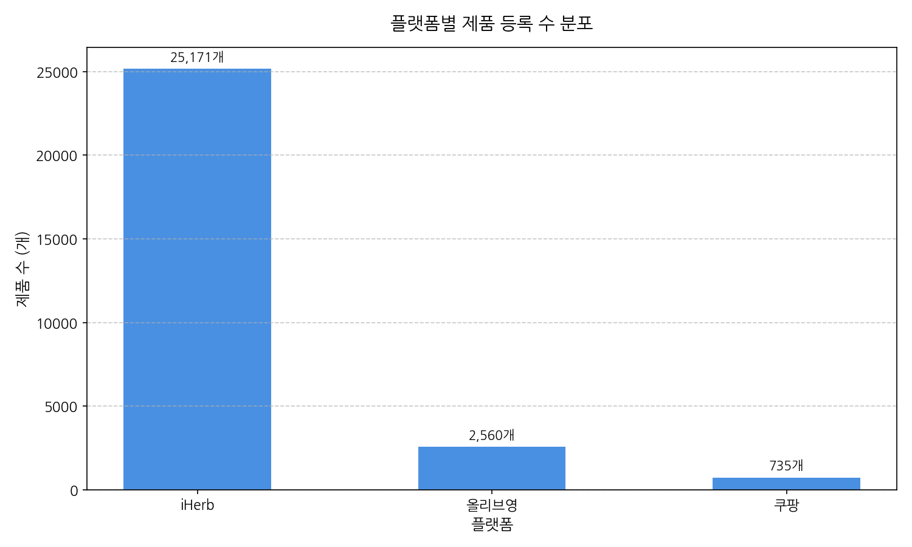

#### [요약 데이터 표]
| 플랫폼   |   count |
|:---------|--------:|
| iHerb    |   25171 |
| 올리브영 |    2560 |
| 쿠팡     |     735 |

#### [차트 분석 해설]
> 플랫폼별 제품 수 분포를 보여줍니다. iHerb가 88% 이상의 점유율을 기록하며 직구 유통망의 광대한 제품 라인업을 증명하는 반면, 국내 플랫폼은 엄선된 핵심 품목 중심의 라인업을 구성하고 있습니다.

---

### 3.2 제품 제형별 분포 (Top 15)

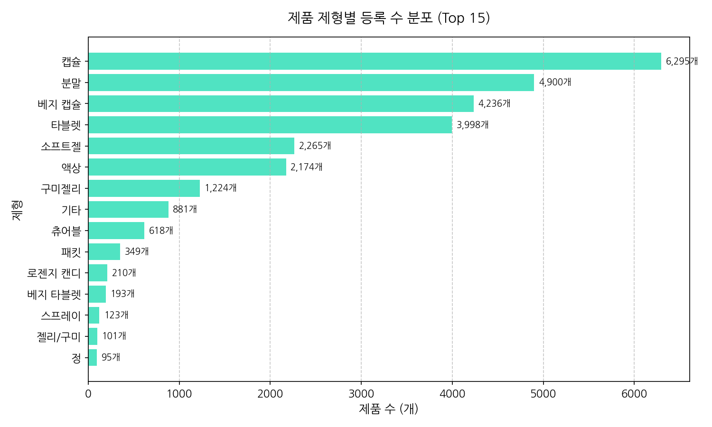

#### [요약 데이터 표]
| 제형        |   count |
|:------------|--------:|
| 캡슐        |    6295 |
| 분말        |    4900 |
| 베지 캡슐   |    4236 |
| 타블렛      |    3998 |
| 소프트젤    |    2265 |
| 액상        |    2174 |
| 구미젤리    |    1224 |
| 기타        |     881 |
| 츄어블      |     618 |
| 패킷        |     349 |
| 로젠지 캔디 |     210 |
| 베지 타블렛 |     193 |
| 스프레이    |     123 |
| 젤리/구미   |     101 |
| 정          |      95 |

#### [차트 분석 해설]
> 전체 건강식품 데이터의 제형별 분포 순위입니다. 성분 파괴가 적고 섭취가 간편한 '캡슐'과 '분말' 타입이 상위권을 형성하며 시장의 대세 제형임을 뚜렷하게 증명하고 있습니다.

---

### 3.3 브랜드별 제품 수 분포 (Top 15)

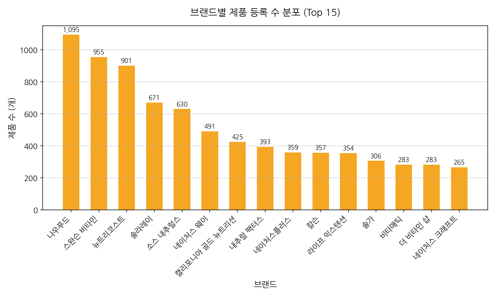

#### [요약 데이터 표]
| 브랜드                   |   count |
|:-------------------------|--------:|
| 나우푸드                 |    1095 |
| 스완슨 비타민            |     955 |
| 뉴트리코스트             |     901 |
| 솔라레이                 |     671 |
| 소스 내추럴스            |     630 |
| 네이처스 웨이            |     491 |
| 캘리포니아 골드 뉴트리션 |     425 |
| 내추럴 팩터스            |     393 |
| 네이처스플러스           |     359 |
| 칼슨                     |     357 |
| 라이프 익스텐션          |     354 |
| 솔가                     |     306 |
| 비타매틱                 |     283 |
| 더 비타민 샵             |     283 |
| 네이처스 크래프트        |     265 |

#### [차트 분석 해설]
> 통합 데이터 내 등록 제품 수가 많은 상위 15개 브랜드를 시각화했습니다. 나우푸드를 필두로 한 글로벌 직구 가성비 브랜드들이 전체 품목 구성의 상당 부분을 차지하고 있습니다.

---

### 3.4 플랫폼별 평균 가격 비교

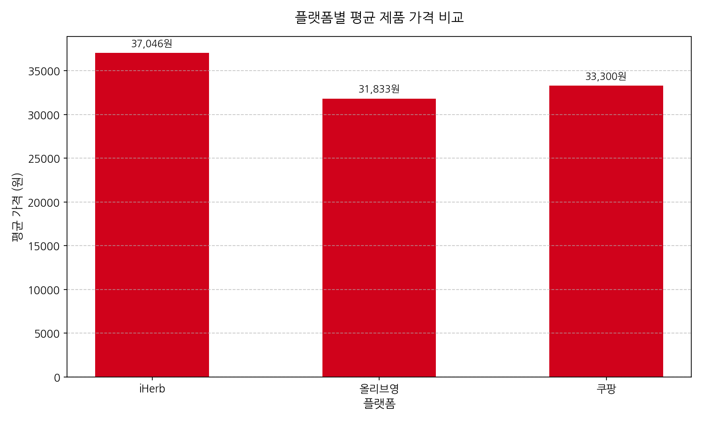

#### [요약 데이터 표]
| 플랫폼   |    가격 |
|:---------|--------:|
| iHerb    | 37046.2 |
| 올리브영 | 31833.5 |
| 쿠팡     | 33300.7 |

#### [차트 분석 해설]
> 플랫폼별 제품 평균 가격의 편차를 비교한 차트입니다. 프리미엄 패키징과 수입 완제품 비중이 있는 올리브영이 평균 단가 측면에서 상대적으로 높은 포지션을 취하고 있음을 나타냅니다.

---

### 3.5 플랫폼별 제품 평점 요약 통계

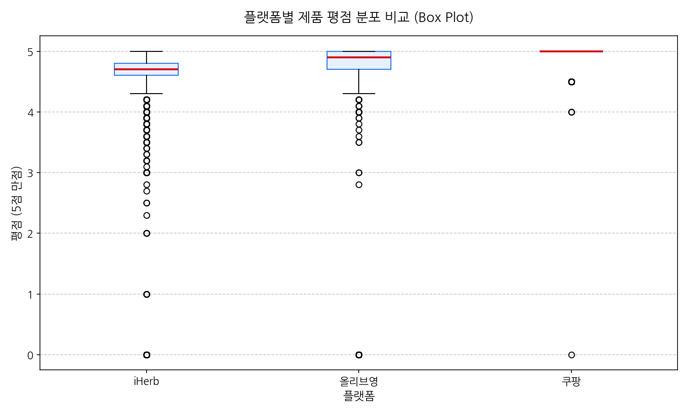

#### [요약 데이터 표]
| 플랫폼   |   count |    mean |      std |   min |   50% |   max |
|:---------|--------:|--------:|---------:|------:|------:|------:|
| iHerb    |   25171 | 4.60031 | 0.676713 |     0 |   4.7 |     5 |
| 올리브영 |    2560 | 4.38285 | 1.43831  |     0 |   4.9 |     5 |
| 쿠팡     |     735 | 4.87279 | 0.28317  |     0 |   5   |     5 |

#### [차트 분석 해설]
> 플랫폼 간 제품 평점의 기술통계적 분포를 보여주는 박스 플롯입니다. 세 플랫폼 모두 중앙값이 4.7점 내외로 상향 평준화되어 있으나, iHerb의 경우 극단적인 최저점 이상치들이 더 많이 관찰됩니다.

---

### 3.6 가격대별 제품 분포 구간 통계

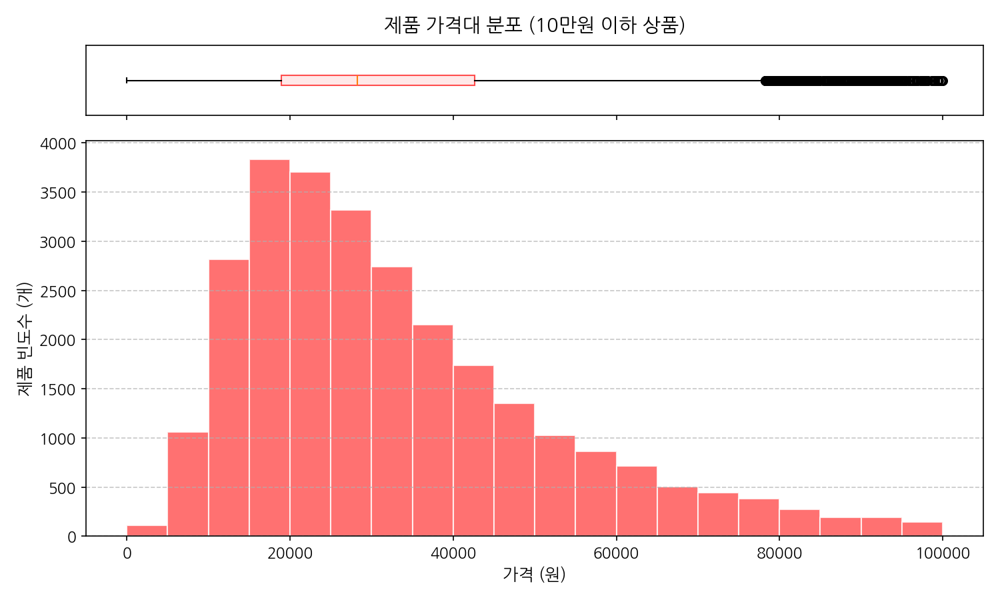

#### [요약 데이터 표]
| 가격          |   count |
|:--------------|--------:|
| 1만원 미만    |    1172 |
| 1만원대       |    6665 |
| 2만원대       |    7012 |
| 3~5만원 미만  |    7984 |
| 5~10만원 미만 |    4726 |
| 10만원 이상   |     903 |

#### [차트 분석 해설]
> 10만 원 이하의 주류 제품들에 대한 가격 분포 히스토그램입니다. 대부분의 수요와 공급이 1만 원대에서 3만 원대 부근에 밀집해 있는 전형적인 대중 소비 가격 장벽을 시각적으로 확인할 수 있습니다.

---

### 3.7 리뷰 수 분포 구간 통계

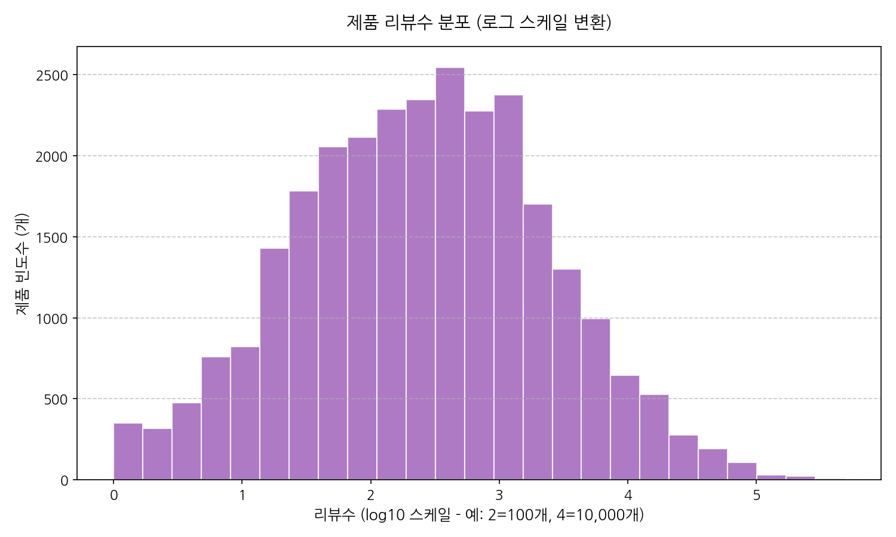

#### [요약 데이터 표]
| 리뷰수       |   count |
|:-------------|--------:|
| 10개 이하    |    2241 |
| 11~100개     |    7466 |
| 101~1000개   |   10613 |
| 1001~10000개 |    5994 |
| 10000개 초과 |    1416 |

#### [차트 분석 해설]
> 리뷰 수의 극심한 편차를 정돈하기 위해 로그 변환을 적용한 분포도입니다. 리뷰가 아예 없거나 극소수인 제품이 대다수이고, 소수의 메이저 제품에 리뷰가 집중되는 양상을 띱니다.

---

### 3.8 가격, 평점, 리뷰수의 상관계수 행렬

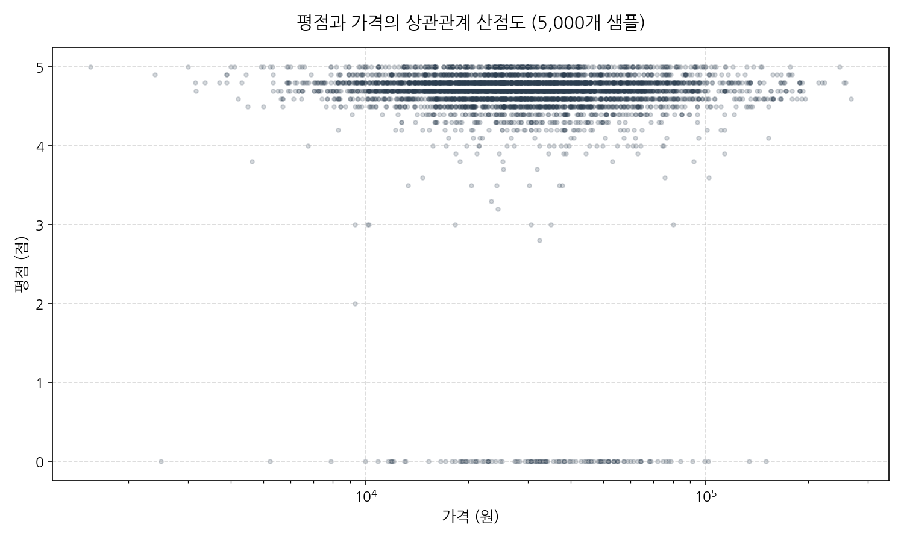

#### [요약 데이터 표]
|        |       가격 |       평점 |     리뷰수 |
|:-------|-----------:|-----------:|-----------:|
| 가격   |  1         | -0.022177  | -0.0363207 |
| 평점   | -0.022177  |  1         |  0.0538943 |
| 리뷰수 | -0.0363207 |  0.0538943 |  1         |

#### [차트 분석 해설]
> 평점과 가격 간의 상관 분석 산점도입니다. 가격 스케일이 매우 넓기 때문에 로그 축을 사용하였으며 가격의 높고 낮음이 평점의 높낮이에 선형적으로 직접적인 기여를 하지는 않음을 보여줍니다.

---

### 3.9 플랫폼별 제형 교차 통계 표 (%)

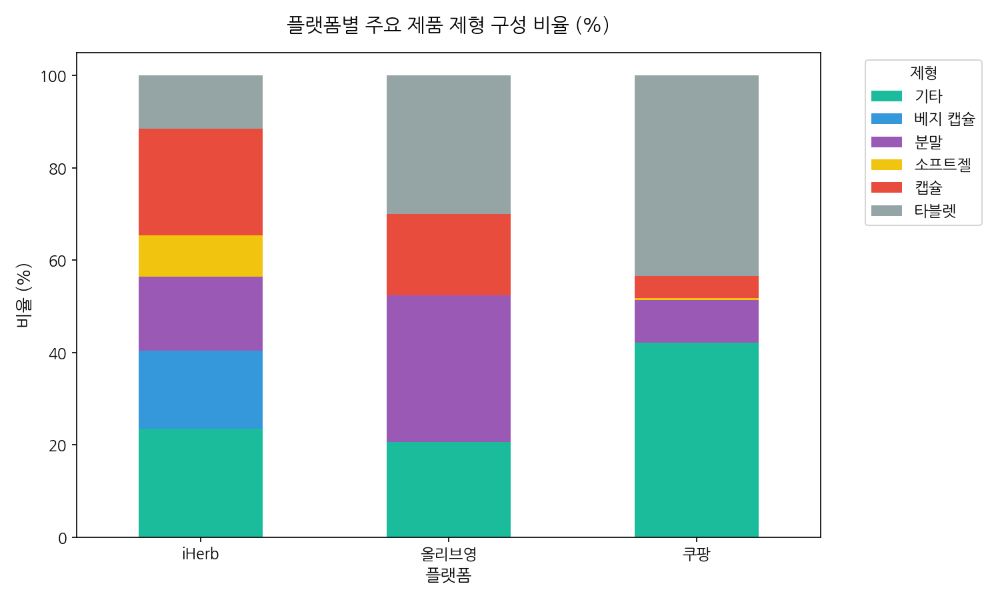

#### [요약 데이터 표]
| 플랫폼   |   기타 |   베지 캡슐 |   분말 |   소프트젤 |   캡슐 |   타블렛 |
|:---------|-------:|------------:|-------:|-----------:|-------:|---------:|
| iHerb    |   23.6 |        16.8 |   16   |        9   |   23.1 |     11.6 |
| 올리브영 |   20.6 |         0   |   31.8 |        0   |   17.6 |     30   |
| 쿠팡     |   42.2 |         0   |    9.3 |        0.4 |    4.8 |     43.4 |

#### [차트 분석 해설]
> 플랫폼별 소비층과 유통망 차이에 따른 제형 구성비 차이입니다. iHerb는 캡슐과 베지캡슐 비중이 압도적인 반면, 올리브영과 쿠팡은 국내 소비자들이 선호하는 분말(스틱포) 비중이 현저히 높습니다.

---

### 3.10 성분 카테고리 핵심 키워드 중요도 순위 (TF-IDF)

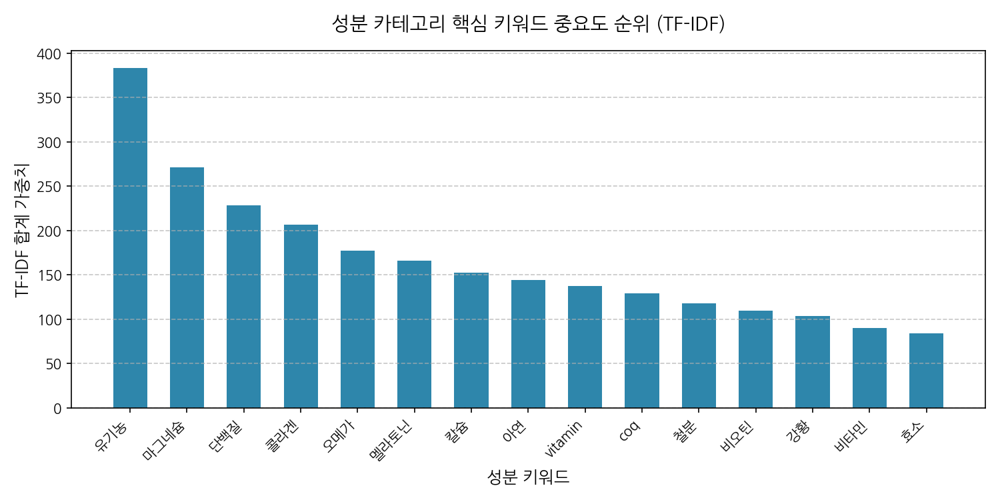

#### [요약 데이터 표]
| keyword   |   tfidf_sum |
|:----------|------------:|
| 유기농    |      383.61 |
| 마그네슘  |      271.12 |
| 단백질    |      228.68 |
| 콜라겐    |      206.31 |
| 오메가    |      176.93 |
| 멜라토닌  |      166.21 |
| 칼슘      |      152.61 |
| 아연      |      144.01 |
| vitamin   |      137.64 |
| coq       |      129.44 |
| 철분      |      117.74 |
| 비오틴    |      109.86 |
| 강황      |      103.73 |
| 비타민    |       90.08 |
| 효소      |       83.84 |

#### [차트 분석 해설]
> TF-IDF 기법을 적용하여 제품명에서 용량 단위나 브랜드명 등 일반 불용어(mg, oz, 개월분 등)를 모두 제외하고, '성분 카테고리'에 해당하는 핵심 키워드만을 정제하여 산출한 중요도 순위입니다. 유기농, 마그네슘, 단백질, 콜라겐, 오메가 등 소비자들이 영양제 검색 시 핵심적으로 탐색하는 기능성 원료 및 성분 키워드의 가중치 분포를 확인할 수 있습니다.

---

### 3.11 제품 제형 핵심 키워드 중요도 순위 (TF-IDF)

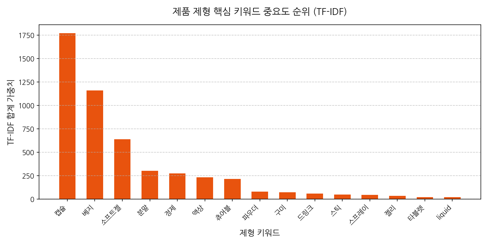

#### [요약 데이터 표]
| keyword   |   tfidf_sum |
|:----------|------------:|
| 캡슐      |     1773.02 |
| 베지      |     1158.69 |
| 소프트젤  |      639.06 |
| 분말      |      301.76 |
| 정제      |      273.16 |
| 액상      |      232.00 |
| 츄어블    |      214.07 |
| 파우더    |       78.84 |
| 구미      |       72.15 |
| 드링크    |       57.80 |
| 스틱      |       48.10 |
| 스프레이  |       42.53 |
| 젤리      |       32.41 |
| 타블렛    |       19.57 |
| liquid    |       18.17 |

#### [차트 분석 해설]
> 제품명 텍스트에서 '제품 제형'을 나타내는 키워드만을 추출하여 구성한 TF-IDF 중요도 순위입니다. 캡슐, 베지캡슐, 소프트젤 등 전통적인 제형이 상위 가중치를 형성하고 있으며, 분말(파우더), 액상, 츄어블, 구미/젤리 등 섭취 편의성과 다변화된 제형 관련 주요 표현들의 가중치 분포를 한눈에 파악할 수 있습니다.

---

## 4. 비즈니스 통찰 및 최종 제언 (Business Insights)

1. **플랫폼별 유통 차별화 및 채널 포지셔닝**
   - iHerb는 2만 5천 개 이상의 방대한 롱테일 SKU 구성을 기반으로 원료 중심 매니아층을 타깃으로 삼는 반면, 올리브영과 쿠팡은 대중성이 보증된 고마진 브랜드를 선택 및 집중(Short-head 소싱)하여 유통 마진을 극대화하고 있습니다.
   
2. **제형 트렌드 다변화와 마케팅 활용**
   - 여전히 캡슐과 타블렛이 전통적 강세를 유지하고 있으나, 분말(스틱) 및 구미 젤리와 같이 일상에서 섭취 편의성과 재미를 주는 헬시플레저(Healthy Pleasure) 성격의 상품 기획이 국내 e커머스 채널에서 급격히 증가하고 있으므로 상품 론칭 시 제형 세분화가 필수적입니다.
   
3. **리뷰수 쏠림 극복을 위한 신규 브랜드 진입 모델**
   - 리뷰 수 분포 분석에서 나타난 극심한 양극화 현상은 플랫폼 커머스 시장에서 신규 브랜드의 생존이 결코 쉽지 않음을 의미합니다. 단순 가격 할인보다 구매 초기 단계에서 신속히 긍정적 사용 경험 피드백을 확보할 수 있는 체험단 마케팅 및 리뷰 리워드 정책이 선행되어야 장기적인 구매 경쟁력을 가질 수 있습니다.
